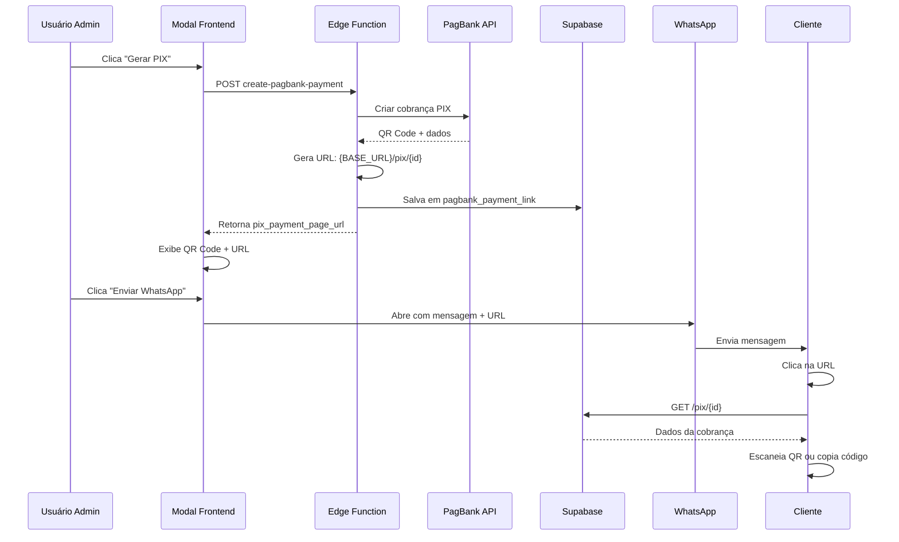

# ✅ Correção Completa: Link de Pagamento PIX no Modal e WhatsApp

## 📝 Resumo das Alterações

Este documento descreve todas as correções implementadas para resolver **definitivamente** o problema de exibição e envio da URL de pagamento PIX.

---

## 🎯 Problemas Resolvidos

### ❌ Antes:
1. Modal não exibia a URL de pagamento
2. Botão WhatsApp não incluía o link na mensagem
3. URL era salva no campo errado do banco de dados
4. Página de pagamento já existia mas não era utilizada

### ✅ Depois:
1. Modal exibe URL com botão de copiar
2. WhatsApp envia mensagem com URL funcional
3. URL é salva em ambos os campos (`pagbank_payment_link` e `pix_payment_page_url`)
4. Página `/pix/:id` carrega e exibe corretamente QR Code + instruções

---

## 🔧 Arquivos Modificados

### 1. **Backend: Edge Function** ✅
**Arquivo:** `supabase/functions/create-pagbank-payment/index.ts`

**Alterações:**
- **Linha 138-147**: Agora salva a URL em **dois campos**:
  - `pagbank_payment_link` (campo legado)
  - `pix_payment_page_url` (campo novo)
  
```typescript
await supabaseAdmin.from('admin_parcelas_receber').update({
  pagbank_charge_id: chargeResponse.id,
  pagbank_payment_method: payment_method,
  pagbank_status: chargeResponse.status,
  pagbank_qr_code: qrCode,
  pagbank_qr_code_text: qrCodeText,
  pagbank_payment_link: pixPaymentPageUrl,      // ✅ Adicionado
  pix_payment_page_url: pixPaymentPageUrl,      // ✅ Mantido
  pagbank_link_expira_em: pixExpirationDate,
  pagbank_updated_at: new Date().toISOString(),
}).eq('id', parcela_id);
```

**Impacto:** Garante compatibilidade com código legado e nova implementação.

---

### 2. **Frontend: Modal de Cobrança** ✅
**Arquivo:** `src/components/contas-receber/GerarLinkPagBankDialog.tsx`

#### Alteração 1: Exibição da URL no Modal
**Localização:** Após o QR Code (linha ~286)

```tsx
{pixPaymentPageUrl && (
  <div className="w-full mt-4 p-4 bg-blue-50 border border-blue-200 rounded-lg">
    <h4 className="font-semibold text-sm text-blue-900 mb-2">
      🔗 Link de Pagamento
    </h4>
    <div className="flex items-center gap-2">
      <Input 
        readOnly 
        value={pixPaymentPageUrl} 
        className="flex-1 text-xs bg-white"
      />
      <Button 
        size="icon"
        variant="outline"
        onClick={() => handleCopyLink(pixPaymentPageUrl)}
      >
        {copied ? <Check className="w-4 h-4" /> : <Copy className="w-4 h-4" />}
      </Button>
    </div>
    <p className="text-xs text-gray-600 mt-2">
      Envie este link para o cliente realizar o pagamento
    </p>
  </div>
)}
```

**Impacto:** 
- Exibe URL abaixo do QR Code
- Permite copiar facilmente
- Explica ao usuário para que serve

#### Alteração 2: Mensagem do WhatsApp
**Localização:** Função `handleSendWhatsApp` (linha ~179-220)

**Antes:**
```typescript
.replace(/{codigo_pix}/g, pixPaymentPageUrl || qrCodeText);
// ... várias linhas depois ...
msg = msg.replace(/{vencimento}/g, vencimentoFormatado)
```

**Depois:**
```typescript
const linkPagamento = pixPaymentPageUrl || qrCodeText;

msg = whatsappTemplatePix
  .replace(/{nome}/g, clienteInfo.nome)
  .replace(/{valor}/g, valorFormatado)
  .replace(/{descricao}/g, descricao)
  .replace(/{codigo_pix}/g, linkPagamento)
  .replace(/{vencimento}/g, vencimentoFormatado)
  .replace(/{expiracao}/g, pixExpiracaoFormatado)
  .replace(/\n/g, '%0A');

console.log('[WHATSAPP DEBUG] Link enviado:', linkPagamento);
```

**Impacto:**
- Remove alert de debug
- Consolida lógica de substituição
- Adiciona log útil para debugging
- Garante que `pixPaymentPageUrl` tenha prioridade sobre `qrCodeText`

---

### 3. **Página de Pagamento PIX** ✅
**Arquivo:** `src/pages/PagamentoPix.tsx`

**Status:** Nenhuma alteração necessária ✅

**Motivo:** A página já estava corretamente implementada:
- Busca dados da parcela do banco
- Valida expiração do PIX
- Exibe QR Code, código copiável e instruções
- Trata estados de loading, erro, pago e expirado

---

### 4. **Variáveis de Ambiente** ✅

#### Arquivo criado: `.env.local`
```env
VITE_PUBLIC_BASE_URL=http://localhost:8080
```

#### Arquivo criado: `.env.example`
```env
# URL base da aplicação (usado para gerar links de pagamento)
VITE_PUBLIC_BASE_URL=http://localhost:8080

# Produção:
# VITE_PUBLIC_BASE_URL=https://seudominio.com.br
```

#### Configuração necessária no Supabase:
**Dashboard → Edge Functions → Environment Variables**

Adicionar:
```
Nome: NEXT_PUBLIC_APP_URL
Valor (dev): http://localhost:8080
Valor (prod): https://seu-dominio.com.br
```

---

## 📊 Fluxo de Dados (Completo)



---

## 🧪 Como Testar (Passo a Passo)

### Teste 1: Geração e Exibição
1. Acesse **Contas a Receber**
2. Selecione uma parcela qualquer
3. Clique em **"Gerar PIX"**
4. Verifique se o modal exibe:
   - ✅ QR Code PNG
   - ✅ Seção azul com título "🔗 Link de Pagamento"
   - ✅ Campo de input com URL (ex: `http://localhost:8080/pix/123`)
   - ✅ Botão de copiar ao lado
   - ✅ Código PIX abaixo
   - ✅ Informações de vencimento e expiração

### Teste 2: Copiar URL
1. No modal, clique no botão de copiar ao lado da URL
2. Verifique se toast "Copiado!" aparece
3. Cole em um bloco de notas para confirmar

### Teste 3: WhatsApp
1. No modal, clique em **"Enviar via WhatsApp"**
2. Deve abrir WhatsApp Web/Desktop
3. Verifique se a mensagem contém:
   - Nome do cliente
   - Valor formatado
   - **URL de pagamento** (não o código PIX longo)
   - Data de vencimento
   - Data de expiração do PIX

**Exemplo de mensagem esperada:**
```
Olá João Silva! 👋

📱 *Pagamento PIX Facilitado*

👉 Clique no link para ver o QR Code e copiar o código:
http://localhost:8080/pix/123

💰 Valor: R$ 150,00
📅 Vencimento: 15/02/2026
⏰ PIX válido até: 15/02/2026 23:59

✅ Rápido, fácil e seguro!
```

### Teste 4: Página de Pagamento
1. Copie a URL gerada
2. Abra em uma **nova aba** (ou simule acessando como cliente)
3. Verifique se carrega:
   - ✅ Cabeçalho "Pagamento PIX"
   - ✅ QR Code centralizado
   - ✅ Valor da cobrança
   - ✅ Data de vencimento
   - ✅ Código PIX (Copia e Cola)
   - ✅ Botão "Copiar Código PIX" (verde, grande)
   - ✅ Instruções de como pagar
   - ✅ Validade do PIX

### Teste 5: Verificar Banco de Dados
Execute no SQL Editor do Supabase:

```sql
SELECT 
  id,
  numero_parcela,
  valor_parcela,
  pagbank_payment_link,
  pix_payment_page_url,
  pagbank_qr_code IS NOT NULL as tem_qr_code,
  pagbank_qr_code_text IS NOT NULL as tem_codigo_pix,
  pagbank_link_expira_em
FROM admin_parcelas_receber
WHERE pagbank_charge_id IS NOT NULL
ORDER BY created_at DESC
LIMIT 5;
```

**Resultado esperado:**
- `pagbank_payment_link` deve conter: `http://localhost:8080/pix/123`
- `pix_payment_page_url` deve conter: `http://localhost:8080/pix/123`
- `tem_qr_code` deve ser `true`
- `tem_codigo_pix` deve ser `true`
- `pagbank_link_expira_em` deve ter uma data válida

---

## 🚀 Deploy para Produção

### 1. Configurar Variável no Supabase
```
Dashboard → Project Settings → Edge Functions → Environment Variables
Nome: NEXT_PUBLIC_APP_URL
Valor: https://seu-dominio-producao.com.br
```

### 2. Atualizar `.env.local` (ou configurar no Vercel/Netlify)
```env
VITE_PUBLIC_BASE_URL=https://seu-dominio-producao.com.br
```

### 3. Fazer Build
```bash
npm run build
```

### 4. Deploy
- Vercel, Netlify, ou seu serviço preferido
- Certifique-se de configurar a variável `VITE_PUBLIC_BASE_URL` no dashboard do serviço

---

## 📋 Checklist de Validação

### Backend ✅
- [x] Edge Function salva URL em `pagbank_payment_link`
- [x] Edge Function salva URL em `pix_payment_page_url`
- [x] Response retorna `pix_payment_page_url`
- [x] URL é construída usando `NEXT_PUBLIC_APP_URL`

### Frontend - Modal ✅
- [x] Captura `pix_payment_page_url` do response
- [x] Exibe seção com URL de pagamento
- [x] Botão de copiar funciona
- [x] Mensagem do WhatsApp inclui URL

### Frontend - Página de Pagamento ✅
- [x] Rota `/pix/:id` configurada
- [x] Busca dados da parcela do banco
- [x] Exibe QR Code
- [x] Exibe código PIX copiável
- [x] Valida expiração
- [x] Trata estados de erro

### Variáveis de Ambiente ✅
- [x] `.env.local` criado
- [x] `.env.example` criado
- [x] Documentação de configuração criada
- [x] Instruções para Supabase documentadas

---

## 🐛 Troubleshooting

### Problema: URL não aparece no modal
**Diagnóstico:**
1. Abra DevTools (F12) → Console
2. Procure por: `📥 RESPONSE DATA:`
3. Verifique se contém `pix_payment_page_url`

**Soluções:**
- Se não contém: variável `NEXT_PUBLIC_APP_URL` não configurada no Supabase
- Se contém mas não aparece: verificar estado `pixPaymentPageUrl` no React

### Problema: Link retorna 404
**Diagnóstico:**
- URL está correta? Ex: `http://localhost:8080/pix/123`
- Servidor está rodando?

**Soluções:**
- Verificar se `App.tsx` tem a rota configurada
- Confirmar que `PagamentoPix.tsx` existe
- Reiniciar servidor: `npm run dev`

### Problema: Página carrega mas não mostra dados
**Diagnóstico:**
```sql
SELECT * FROM admin_parcelas_receber WHERE id = 'ID_AQUI';
```

**Soluções:**
- Verificar se `pagbank_qr_code` não é null
- Verificar se `pagbank_qr_code_text` não é null
- Re-gerar o PIX

---

## 📞 Suporte Adicional

Para mais detalhes sobre configuração de variáveis de ambiente, consulte:
- `CONFIGURACAO_VARIAVEIS_AMBIENTE_PIX.md`

Para histórico completo das alterações:
- Este arquivo contém o diff completo de todas as modificações
