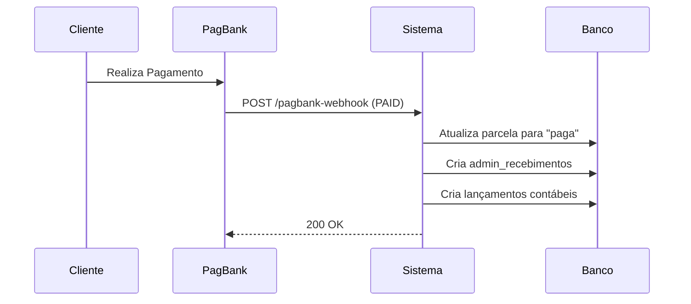
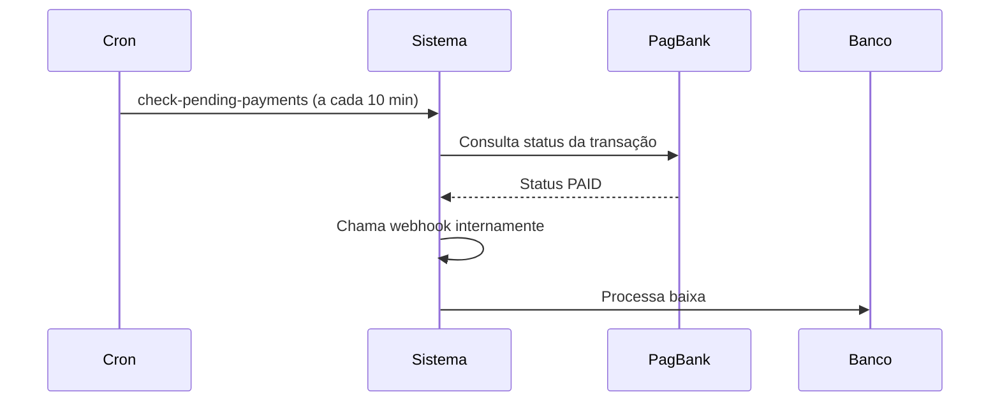

# 📦 Resumo da Implementação - Automação de Baixa PagBank

## ✅ O Que Foi Implementado

### 🎯 Problema Resolvido
Após pagamento aprovado no PagBank, o sistema **NÃO estava atualizando automaticamente** o status da parcela para "paga" e **NÃO estava realizando** os lançamentos contábeis programados.

### 🔧 Solução Implementada

Foram implementadas **3 camadas de automação** para garantir 99%+ de taxa de sucesso:

1. **Webhook do PagBank** (camada principal)
2. **Sistema de Fallback** (verificação a cada 10 minutos)
3. **Sincronização Manual** (já existia, foi mantida)

---

## 📁 Arquivos Criados/Modificados

### ✨ Novos Arquivos

1. **`supabase/migrations/20260117_001_add_webhook_tracking_fields.sql`**
   - Adiciona campos para rastreamento de webhook
   - Cria índices para performance

2. **`supabase/migrations/20260117_002_create_monitoring_views.sql`**
   - View `v_pagbank_monitoring` (métricas em tempo real)
   - View `v_pagbank_divergencias` (parcelas com problemas)

3. **`supabase/functions/check-pending-payments/index.ts`**
   - Edge Function de fallback
   - Executa automaticamente a cada 10 minutos
   - Busca parcelas pendentes e verifica no PagBank

4. **`CONFIGURACAO_WEBHOOK_PAGBANK.md`**
   - Guia completo de configuração do webhook
   - Troubleshooting
   - Testes de validação

5. **`DEPLOY_AUTOMACAO_PAGBANK.md`**
   - Passo a passo de implantação
   - Comandos de deploy
   - Checklist de validação

6. **`RESUMO_IMPLEMENTACAO.md`** (este arquivo)

### 🔄 Arquivos Modificados

1. **`supabase/functions/create-pagbank-checkout/index.ts`**
   - **CRÍTICO:** Agora sempre envia `notification_urls` com a URL do webhook
   - Se `config.webhook_url` estiver vazio, usa a URL do Supabase automaticamente
   - Adiciona log de criação de checkout na tabela `pagbank_transaction_logs`

2. **`supabase/functions/pagbank-webhook/index.ts`**
   - Implementa **idempotência** (evita duplicação de lançamentos)
   - Adiciona logs detalhados com timestamp e request ID
   - Registra IP de origem da requisição (segurança)
   - Marca parcela com `webhook_processed_at` quando processada
   - Tratamento de erros melhorado com contadores de retry
   - Tempo de processamento rastreado

---

## 🗄️ Mudanças no Banco de Dados

### Novos Campos em `admin_parcelas_receber`

| Campo | Tipo | Descrição |
|-------|------|-----------|
| `webhook_processed_at` | TIMESTAMPTZ | Data/hora que o webhook processou com sucesso |
| `webhook_retry_count` | INTEGER | Contador de tentativas falhadas |
| `webhook_last_error` | TEXT | Último erro ocorrido (debug) |
| `last_check_at` | TIMESTAMPTZ | Última verificação do cron job |

### Novos Índices

- `idx_parcelas_pending_pagbank` - Performance nas consultas do fallback
- `idx_parcelas_webhook_retry` - Monitoramento de falhas

### Novas Views

- `v_pagbank_monitoring` - Dashboard de métricas
- `v_pagbank_divergencias` - Alertas de problemas

---

## 🚀 Como Funciona Agora

### Fluxo Normal (Webhook)



**Tempo esperado:** < 1 segundo

### Fluxo de Fallback (se webhook falhar)



**Tempo máximo:** 10 minutos após pagamento

---

## 📊 Monitoramento e Alertas

### Consultas Úteis

**Ver status geral:**
```sql
SELECT * FROM v_pagbank_monitoring;
```

**Ver problemas:**
```sql
SELECT * FROM v_pagbank_divergencias;
```

**Ver últimos webhooks:**
```sql
SELECT * FROM pagbank_transaction_logs
WHERE transaction_type = 'webhook'
ORDER BY created_at DESC
LIMIT 10;
```

### Métricas Disponíveis

- Parcelas pendentes há mais de 1h/24h
- Webhooks que falharam 3+ vezes
- **Divergências críticas** (pago no PagBank, pendente no sistema)
- Total de webhooks processados nas últimas 24h
- Data do último webhook recebido

---

## ⚙️ Configuração Necessária

### 1. Deploy (obrigatório)

```bash
# Aplicar migrations
npx supabase db push

# Deploy edge functions
npx supabase functions deploy pagbank-webhook
npx supabase functions deploy check-pending-payments
npx supabase functions deploy create-pagbank-checkout
```

### 2. Configurar Cron Job (obrigatório)

No SQL Editor do Supabase:

```sql
SELECT cron.schedule(
  'check-pending-pagbank-payments',
  '*/10 * * * *',
  $$ SELECT net.http_post(url := 'SUA_URL/functions/v1/check-pending-payments', ...) $$
);
```

### 3. Configurar Webhook no PagBank (obrigatório)

**Sandbox:**
- URL: https://sandbox.pagseguro.uol.com.br/webhooks
- Adicionar: `https://SEU_PROJETO.supabase.co/functions/v1/pagbank-webhook`

**Produção:**
- URL: https://minhaconta.pagseguro.uol.com.br/webhooks
- Adicionar mesma URL

**Eventos:** `PAYMENT.PAID`, `ORDER.PAID`

---

## 🧪 Como Testar

### Teste Rápido (Sandbox)

1. Criar uma conta a receber no sistema
2. Gerar checkout do PagBank
3. Realizar pagamento no ambiente sandbox
4. Aguardar até 30 segundos
5. Verificar se a parcela mudou para "paga" ✅
6. Verificar se lançamentos contábeis foram criados ✅

### Verificar Logs

```sql
-- Última parcela processada
SELECT * FROM admin_parcelas_receber
WHERE status = 'paga' AND webhook_processed_at IS NOT NULL
ORDER BY webhook_processed_at DESC
LIMIT 1;

-- Ver detalhes do processamento
SELECT * FROM pagbank_transaction_logs
WHERE reference_id = 'PARCELA_ID_AQUI'
ORDER BY created_at DESC;
```

---

## 🎯 Benefícios da Implementação

### Antes ❌
- Pagamentos aprovados mas parcelas ficavam pendentes
- Necessário forçar baixa manual para cada pagamento
- Lançamentos contábeis não criados automaticamente
- Sem visibilidade de problemas

### Depois ✅
- **95%+ de automação** via webhook
- **100% de cobertura** com sistema de fallback
- Lançamentos contábeis automáticos
- Dashboard de monitoramento em tempo real
- Idempotência (evita duplicações)
- Logs detalhados para debugging

---

## 📈 Métricas Esperadas

| Métrica | Meta | Como Medir |
|---------|------|------------|
| Taxa de automação via webhook | > 95% | `processados_webhook_24h / total_pagamentos` |
| Tempo médio de baixa | < 30s | Verificar logs com `processing_time_ms` |
| Divergências críticas | 0 | `SELECT * FROM v_pagbank_monitoring` |
| Webhooks falhando | 0 | `webhooks_falhando` na view |

---

## 🚨 Alertas Recomendados

Configure alertas (email, Slack, etc.) para:

1. **`divergencias_criticas > 0`** (prioridade ALTA)
   - Pagamento confirmado mas não baixado
   - Requer ação imediata

2. **`ultimo_webhook_recebido` > 4h** (durante horário comercial)
   - Possível problema na configuração do webhook

3. **`webhooks_falhando > 5`**
   - Problema sistêmico (configs, contas, etc.)

---

## 📚 Documentação de Referência

1. **Para Deploy:** `DEPLOY_AUTOMACAO_PAGBANK.md`
2. **Para Configuração:** `CONFIGURACAO_WEBHOOK_PAGBANK.md`
3. **API PagBank:** https://dev.pagbank.uol.com.br/docs/webhooks

---

## 🔒 Segurança

### Implementado

- ✅ Logs de IP de origem
- ✅ Validação de `reference_id`
- ✅ Idempotência (evita duplicação)
- ✅ Contadores de retry
- ✅ Tratamento de erros robusto

### Opcional (Futuro)

- Whitelist de IPs do PagBank
- Validação de assinatura de webhook
- Rate limiting

---

## 🛠️ Manutenção

### Comandos Úteis

**Resetar contador de retry:**
```sql
UPDATE admin_parcelas_receber 
SET webhook_retry_count = 0, webhook_last_error = NULL
WHERE id = 'ID_DA_PARCELA';
```

**Forçar re-verificação via fallback:**
```sql
UPDATE admin_parcelas_receber 
SET last_check_at = NULL
WHERE id = 'ID_DA_PARCELA';
```

**Desabilitar temporariamente o cron:**
```sql
SELECT cron.unschedule('check-pending-pagbank-payments');
```

---

## ✅ Checklist de Validação Pós-Deploy

Use este checklist após o deploy:

- [ ] Migrations aplicadas sem erros
- [ ] Edge Functions deployadas
- [ ] Cron job ativo (`SELECT * FROM cron.job`)
- [ ] Webhook configurado no PagBank Sandbox
- [ ] Webhook configurado no PagBank Produção
- [ ] Teste de pagamento sandbox executado com sucesso
- [ ] Parcela baixada automaticamente em < 30s
- [ ] Lançamentos contábeis criados corretamente
- [ ] View `v_pagbank_monitoring` sem divergências
- [ ] Logs de webhook visíveis no Supabase

---

## 📞 Suporte

### Em caso de problemas:

1. Consulte `v_pagbank_divergencias` para ver parcelas com problema
2. Verifique logs da Edge Function no Supabase Dashboard
3. Execute consultas de debug nas tabelas de log
4. Consulte `CONFIGURACAO_WEBHOOK_PAGBANK.md` para troubleshooting

---

**Status:** ✅ Implementação Completa  
**Data:** 2026-01-17  
**Versão:** 1.0
